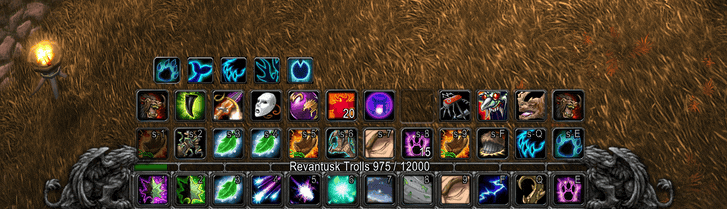
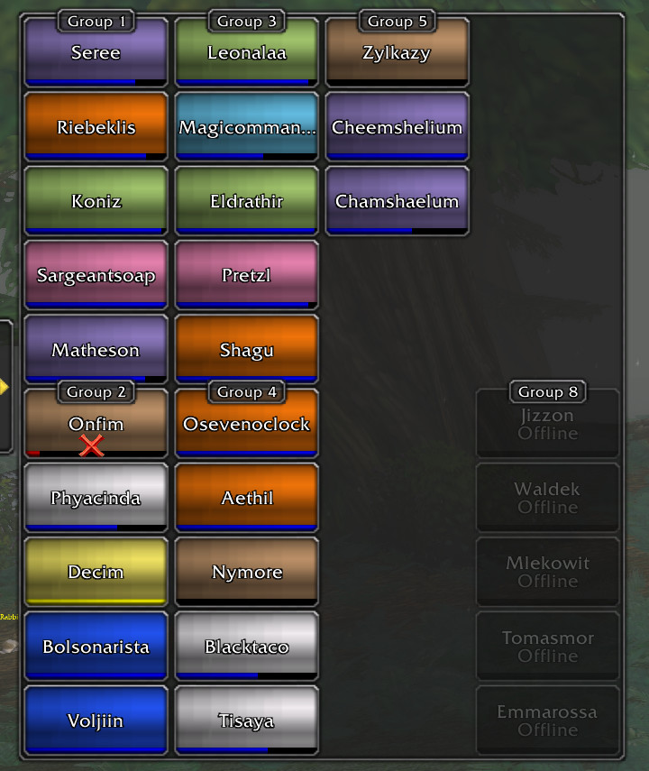

# ShaguTweaks-extras

This addon extends the capabilities of [ShaguTweaks](https://github.com/shagu/ShaguTweaks) by offering optional modules that can be easily toggled on or off. The new features integrate fully with the "Advanced Options" panel, providing a seamless experience.

For a detailed view of what's new and improved, check out the feature list below.

## Installation (Vanilla, 1.12)

> [!IMPORTANT]
>
> **This addon requires you to have [ShaguTweaks](https://github.com/shagu/ShaguTweaks) installed.**
>
> Install instructions for ShaguTweaks can be found on the [GitHub Page](https://github.com/shagu/ShaguTweaks).

1. Download **[Latest Version](https://github.com/shagu/ShaguTweaks-extras/archive/master.zip)**
2. Unpack the Zip file
3. Rename the folder "ShaguTweaks-extras-master" to "ShaguTweaks-extras"
4. Copy "ShaguTweaks-extras" into Wow-Directory\Interface\AddOns
5. Restart Wow

## Features

### Action Bar
- **Center Vertical Actionbar**  
  *Center the vertical actionbar on the right side.*

- **Dragonflight Gryphons**  
  *Replaces actionbar gryphons with the dragonflight version.*

- **Floating Actionbar**  
  *Removes all background textures and lets the actionbar float.*

- **Reagent Counter**  
  *Shows a reagent counter on action buttons.*

- **Show Bags**  
  *Shows bag and keyring buttons when using the reduced actionbar layout. Hold Ctrl+Shift to move the bag bar.*

- **Show Micro Menu**  
  *Shows micro menu buttons when using the reduced actionbar layout. Hold Ctrl+Shift to move the micro menu.*

### Chat
- **Chat History**  
  *Save chat history of all non-combatlog windows and restore it on login.*

- **Center Text Input Box**  
  *Move the chat input box to the center of the screen.*

- **Enable Text Shadow**  
  *Enable text shadow in all chat frames.*

### General
- **Bag Search Bar**  
  *Adds a search field to the bag which allows you to search bag, keyring and bank slots.*

- **Show Energy Ticks**  
  *Show energy and mana ticks on the player unit frame.*

- **Reveal World Map**  
  *Reveals unexplored world map areas and shows exploration hints.*

### Macro
- **Macro Icons**  
  *Detect showtooltip and spells in macros to use them on action buttons.*

- **Macro Tweaks**  
  *Add /equip command to macros, remove #showtooltip from chat and hide macro commands from history.*

### Raid

- **Enable Raid Frames**  
  *Very simple raid frames with only the most basic features.*

- **Hide Party Frames**  
  *Disable default party frames while the raidframes are active.*

- **Show Aggro Indicators**  
  *Show indicators on raid members that are currently attacked by other units. (This only works if the unit is a target of a raid member)*

- **Show Combat Feedback**  
  *Show combat feedback numbers on health bars.*

- **Show Dispel Indicators**  
  *Show indicators for units affected by curse, magic, poison or diseases based on your class.*

- **Show Group Headers**  
  *Display group headers on raid frames*

- **Show Healing Predictions**  
  *Show healing predictions that are received in a healcomm compatible protocol.*

- **Use As Party Frames**  
  *Use raid frames to display party members in regular groups*

- **Use Compact Layout**  
  *Reduces the raid frame size and the displayed elements. As a healer, you should never use this layout.*

## Contact & Support
Due to time constraints, I am currently unable to process feature requests. However, if you encounter any bugs or issues, please don't hesitate to reach out to me through Discord.
